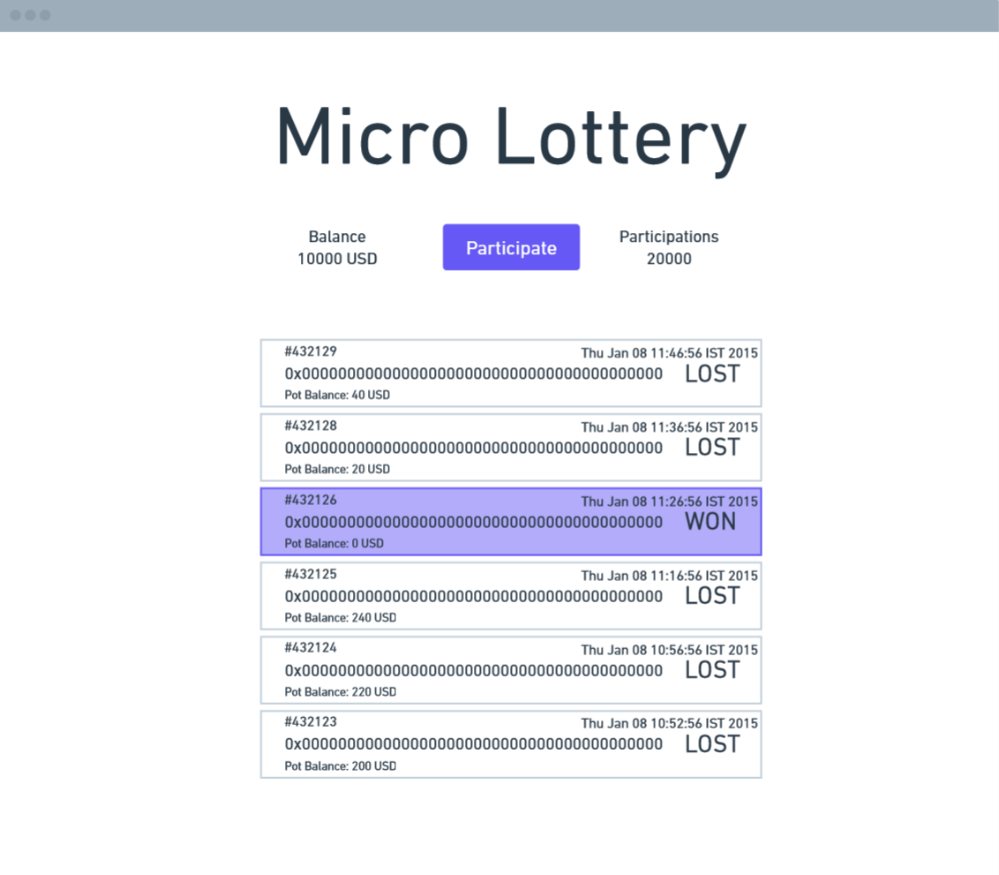

# Micro Lottery

The Micro Lottery is my educational project to learn more about Web3 development.

## Table of Contents

- [Micro Lottery](#micro-lottery)
  - [Table of Contents](#table-of-contents)
  - [Goals](#goals)
  - [Requirements](#requirements)
  - [Run locally](#run-locally)

## Goals



The goal is to create a simple lottery where participants can ingress.

Each time a new user participates in the lottery, they
have to contribute with a pre-defined amount to the Pot.

Each participant has a chance of gaining the entire Pot.

## Requirements

1. `nodejs` for `hardhat`, `react`, `web3js`, etc..
2. An [https://www.alchemy.com](https://www.alchemy.com) or [infura.io/](infura.io/) account
3. Ether on your account to deploy the contract
4. LINK on your account to fund the contract. You can use [ChainLink's faucet](https://faucets.chain.link/) to fund your account on testnets.

To install the same version of `nodejs` I've used, take a look at the [.tool-versions](./.tool-versions) file. To make it easier, you can use [`asdf install`](https://asdf-vm.com/) and it will automatically use the correct runtimes.

## Run locally

1. Clone this repository.
2. Install the node dependencies.

   ```bash
   cd micro-lottery
   yarn install
   ```

3. Run a local node of ethereum and deploy the [MicroLottery.sol](./hardhat/contracts/MicroLottery.sol) contract.

   ```bash
    yarn run contracts:start
   ```

4. On a different terminal

   ```bash
   yarn run frontend:start
   ```
